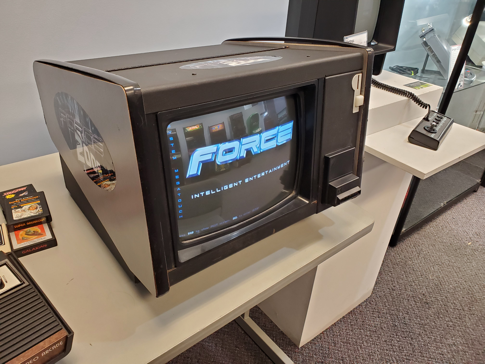

# Rumble 31

- [Play The Game Here!](https://blackchip.org/rumble31)
- [How To Play](how-to-play.md)

A card game based on [Thirty-One](https://en.wikipedia.org/wiki/Thirty-one_(card_game)).
This variation comes from the game with a similar name on the MegaTouch
machines. The closest ruleset I could find is on the Dutch Wikipedia page
for [Eenendertigen](https://nl.wikipedia.org/wiki/Eenendertigen). This game
implements a combination of the Dutch rules and what I learned playing a
MegaTouch at the [System Source Computer Museum](https://museum.syssrc.com/).
 If you find any inaccuracies in the rules, be sure to let me know!

I've always wanted to create a remake of this game but I could just never
find the time. I decided to give it a try with Claude Code and the results
were better than I expected. It's still rough around the edges but it is
fun to play.

See [setup.md](setup.md) for setup instructions and
[toolchain.md](toolchain.md) for the full toolchain (tests, type
checking, playing in the browser, and simulations).

# Contact

Send an email to games@blackchip.org

# License

This code uses the [MIT license](LICENSE). Open-source assets are used in
this project and their licenses are documented in [licenses.txt](licenses.txt)

